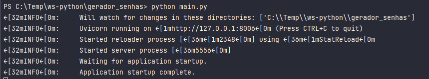
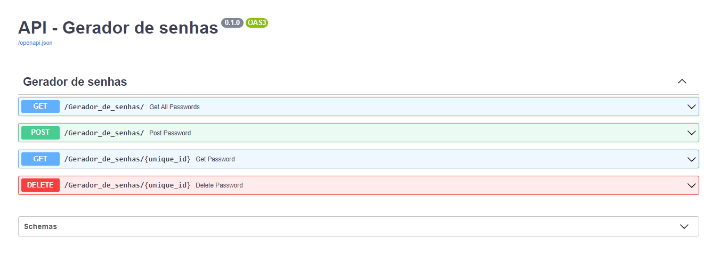
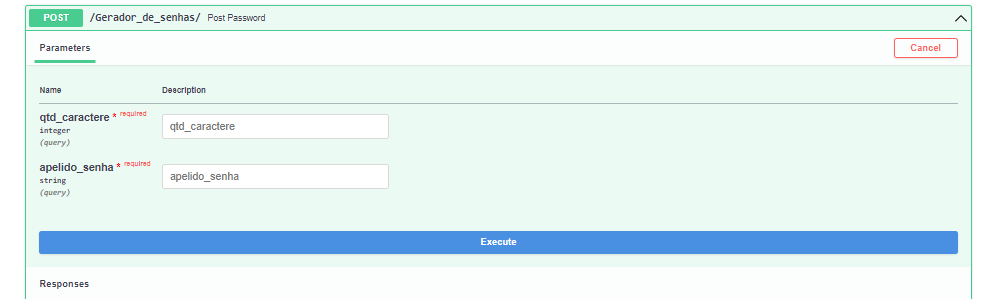

# Projeto Gerador de senhas fortes.

Nesse repositório contém um projeto realizado com python assíncrono e o framework
FastAPI.

O projeto consiste em um sistema (CRUD) gerador de senhas forte, onde o usuário do sistema consegue gerar a sua senha 
com a quatidade de caracteres que desejar e dar um "apelido" para esse senha como identificação e o sistema vai gerar 
o range com caracteres aleatórios respeitando a quantidade desejada de caracteres.

exemplos:

- Rota para gerar a senha (método post);
- Rota para buscar no banco de dados todas as senhas geradas (método get);
- Rota para buscar no banco de dados uma senha específica através do seu identificador (método get);
- Rota para deletar uma senha gerada (método delete).

### Pré-requisitos

- Python
- O banco de dados é de sua escolha, mas nesse projeto utilizei o MongoDB e a bibliotéca Pymongo
- Instalação dos requeriments.txt disponibilizados

### Execução do sistema

- Basta entrar no diretório do sistema e no terminal rodar o comando: python main.py
e o retorno é o http com as rotas.

#### Exemplo da execução

### Exemplos das rotas criadas:

#### Exemplo da rota post:

